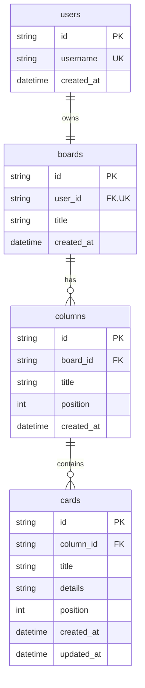

# Database

The MVP uses SQLite via SQLAlchemy 2.x (sync) on the FastAPI backend. A single `pm.db` file lives at `data/pm.db` (path is configurable via `DATABASE_URL`). The file is created on first start; the schema is applied via `Base.metadata.create_all` on app startup, so there are no Alembic migrations for the MVP.

## Naming convention

SQL **table names are plural** (`users`, `boards`, `columns`, `cards`); SQLAlchemy **class names are singular** (`User`, `Board`, `Column`, `Card`). Each model declares its table explicitly via `__tablename__`. This is documented once here so the convention stays consistent as the codebase grows.

**Caveat:** `columns` is a reserved word in standard SQL. SQLite treats it as an unquoted identifier fine, but if the database is ever moved to Postgres we'll need to either quote the table (`Table(..., quote=True)`) or rename it. Flagged here so it isn't a surprise later.

## Stack

- **ORM:** SQLAlchemy 2.x (sync). Picked over async (SQLAlchemy async, SQLModel async, Tortoise) because the MVP is a small, single-process server and synchronous code is simpler to read and test. The FastAPI handlers stay simple — DB work happens in a `get_db` dependency.
- **Database:** SQLite. The spec calls for it; it removes the operational overhead of Postgres for a single-user demo. A future part can switch to Postgres by changing `DATABASE_URL`.
- **IDs:** UUID4 strings, generated in Python (`uuid.uuid4()`) and stored as `TEXT`. Stable, hard to guess, and identical in shape to the ids the frontend already uses for in-memory cards. Keeps the JSON wire format and the database row format aligned.
- **Migrations:** None for the MVP. Schema changes are applied via `create_all`; for the demo, the database is ephemeral and can be wiped. When the project graduates to real users we'll introduce Alembic.

## ER overview

```
users ──1:1── boards ──1:N── columns ──1:N── cards
```



## Tables

### `users` (`User`)
One row per signed-up user. For the MVP only the hardcoded `user` row exists (created by the seeder if absent). Real auth lands later; this table currently exists so the foreign key from `boards` is honest.

- `id` (uuid, pk) — server-generated.
- `username` (string, unique) — used by the existing fake login. Unique so we can map username → user on future login flows.
- `created_at` (datetime) — set on insert.

### `boards` (`Board`)
One board per user (enforced by `UNIQUE (user_id)`). The MVP is single-board per user, so the uniqueness constraint is the cleanest way to express that. Drop the constraint if/when multi-board is added.

- `id` (uuid, pk)
- `user_id` (uuid, fk → `users.id`, unique)
- `title` (string) — currently always "Kanban Studio" but kept as a column so we don't have to migrate the moment someone wants to rename it.
- `created_at` (datetime)

### `columns` (`Column`)
The five fixed stages of the demo (Backlog / Discovery / In Progress / Review / Done) are stored as rows so the user can rename them and so the title is data, not a hardcoded enum. New columns can be added without a schema change.

- `id` (uuid, pk)
- `board_id` (uuid, fk → `boards.id`, indexed)
- `title` (string) — user-visible, renameable.
- `position` (int) — see *Ordering* below.
- `created_at` (datetime)
- `UNIQUE (board_id, position)` — keeps renumbering honest.

### `cards` (`Card`)
The unit of work. `details` is free text and may be empty. The frontend already stores `title` + `details`; matching that here keeps the API and the React state shape identical.

- `id` (uuid, pk)
- `column_id` (uuid, fk → `columns.id`, indexed)
- `title` (string, non-empty)
- `details` (string, default `""`)
- `position` (int)
- `created_at`, `updated_at` (datetime) — `updated_at` is set by the SQLAlchemy `onupdate` hook and on any explicit update.
- `UNIQUE (column_id, position)`

## Ordering

Both `columns.position` and `cards.position` are tight integers renumbered on every write. Concretely:

- When a card is created at the end of a column, its `position` is `max(position in column) + 1` (or `0` for an empty column).
- When a card moves between columns or reorders, the affected columns renumber their cards to `0..N-1` in a single transaction.
- When a column is renamed, position is untouched.

This trades a few extra writes per move for a much simpler model: no sparse floats, no mid-insert re-spacing, no client-side hint to "guess where the drop landed." For a single-user demo with a handful of cards per column, the cost is invisible.

## Seeding

The seed runs once, on app startup, when the `users` table is empty. It inserts the demo `user` row only — no board, no columns, no cards. The user lands on an empty board and adds their own content via the API.

The 5-column, 8-card demo data that ships in `frontend/src/lib/kanban.ts` (Backlog, Discovery, In Progress, Review, Done + 8 seed cards) is **not** seeded into the database. When Part 7 wires the frontend to the API, the frontend drops `initialData` and the API returns whatever the user has created. The demo's 5 columns and 8 cards become the suggested state on first run, not a hidden pre-population of the database.

## API surface (preview for Part 6)

| Endpoint | Touches |
| --- | --- |
| `GET /api/board` | `boards`, `columns`, `cards` for the current user's board |
| `PATCH /api/board` | `columns.title` (rename in place) |
| `POST /api/board/cards` | `cards` (insert + renumber target column) |
| `PATCH /api/board/cards/{id}` | `cards` (update title/details) |
| `DELETE /api/board/cards/{id}` | `cards` (delete + renumber source column) |
| `POST /api/board/cards/{id}/move` | `cards` (move + renumber both source and target columns) |

All endpoints run inside a `get_db` session and require `get_current_user`. They will validate that the touched `Card`/`Column` belongs to a `Board` owned by the current user before mutating.

## Future-proofing (not committed)

These are recorded so the schema doesn't paint us into a corner, but the MVP does not implement them:

- **Multi-board per user.** Drop the `UNIQUE (user_id)` on `boards`; add a `GET /api/boards` endpoint and a board switcher in the UI.
- **Real auth.** Add a `password_hash` column on `users`, swap the signed-cookie MVP for a hashed credential check. The cookie's signed payload already carries the `User.id`, so the rest of the code is unaffected.
- **Card assignees, labels, due dates.** Add as nullable columns on `cards`; no migration cost since the table is small.
- **Migrations.** Once schema changes start happening in production, introduce Alembic. For the MVP, `create_all` on startup is sufficient.

## Files (in Part 6)

- `backend/app/database.py` — engine, `SessionLocal`, `get_db`, `Base`.
- `backend/app/models.py` — SQLAlchemy 2.x declarative models matching this schema.
- `backend/app/seed.py` — idempotent seeder for the demo `user`.
- `backend/app/schemas.py` — Pydantic request/response DTOs.
